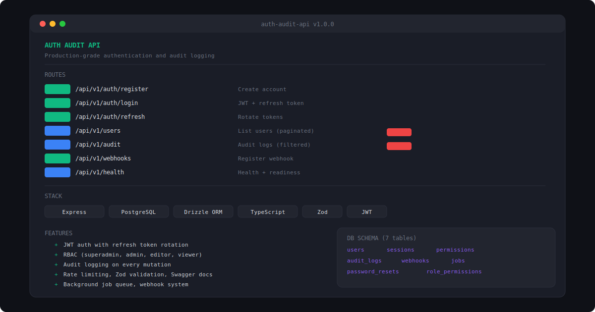
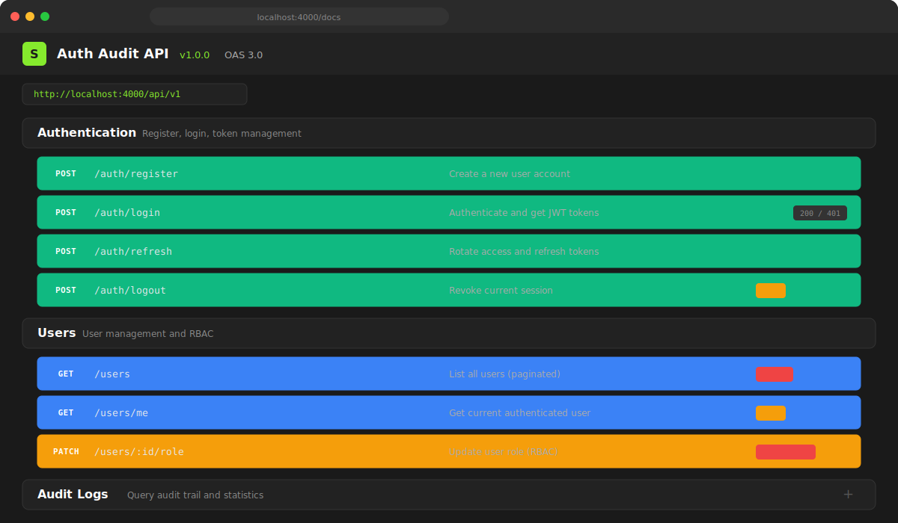
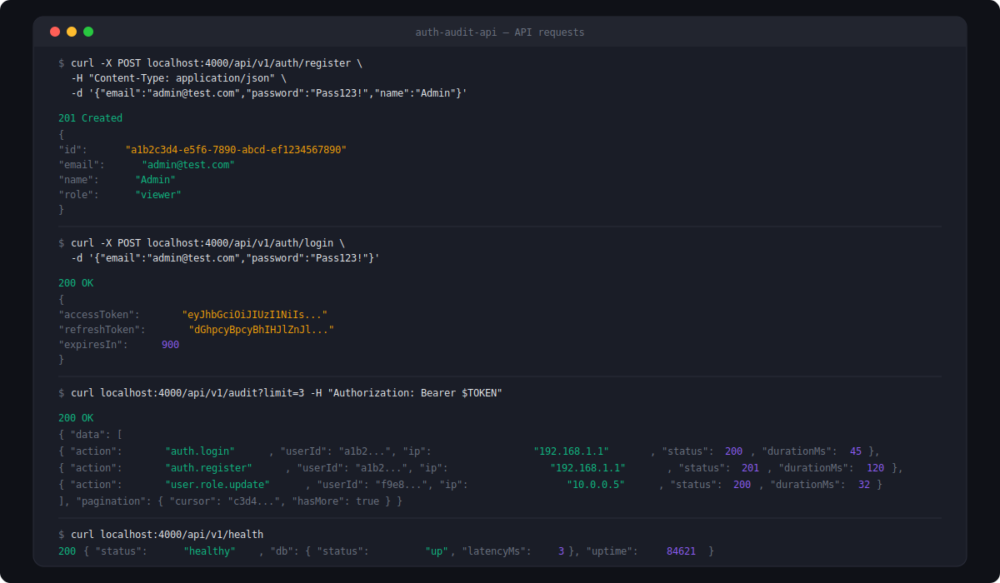

# Auth Audit API

Production-grade authentication and audit logging REST API built with Express, TypeScript, and PostgreSQL.



### Swagger Documentation


### API Demo


## Features

- **Auth** — Register, login, refresh, logout, password reset
- **JWT Tokens** — 15min access tokens + 7-day refresh tokens with rotation
- **RBAC** — Superadmin, admin, editor, viewer roles with permissions matrix
- **Audit Logging** — Every mutation logged with user, IP, duration, and status code
- **Rate Limiting** — Per-route rate limiting with configurable windows
- **Validation** — Zod middleware on all endpoints
- **Webhooks** — Register URLs, signed payloads (HMAC-SHA256), test endpoint
- **Job Queue** — Background job processing with retries and scheduling
- **API Docs** — Auto-generated OpenAPI/Swagger documentation
- **Health Checks** — Liveness and readiness probes with DB latency
- **Pagination** — Cursor-based pagination with sorting and filtering on all list endpoints

## Tech Stack

- **Runtime:** Node.js + Express
- **Language:** TypeScript
- **Database:** PostgreSQL with Drizzle ORM
- **Auth:** JWT (jsonwebtoken) + bcryptjs
- **Validation:** Zod
- **Docs:** Swagger UI + OpenAPI 3.0
- **Logging:** Winston
- **Security:** Helmet, CORS, rate limiting

## Getting Started

```bash
git clone https://github.com/idirdev/auth-audit-api.git
cd auth-audit-api
npm install

# Setup
cp .env.example .env
# Edit .env with your database connection
npm run db:push

# Run
npm run dev       # Development with hot-reload
npm run build     # Compile TypeScript
npm start         # Production
```

## API Endpoints

| Method | Endpoint | Description | Auth |
|--------|----------|-------------|------|
| POST | `/api/v1/auth/register` | Create account | - |
| POST | `/api/v1/auth/login` | Get JWT tokens | - |
| POST | `/api/v1/auth/refresh` | Rotate tokens | - |
| POST | `/api/v1/auth/logout` | Revoke session | Bearer |
| POST | `/api/v1/auth/forgot-password` | Request reset | - |
| GET | `/api/v1/users` | List users | Admin |
| GET | `/api/v1/users/me` | Current user | Bearer |
| PATCH | `/api/v1/users/:id/role` | Update role | Superadmin |
| GET | `/api/v1/audit` | Audit logs | Admin |
| GET | `/api/v1/audit/stats` | Audit stats | Admin |
| GET/POST | `/api/v1/webhooks` | Manage webhooks | Admin |
| GET | `/api/v1/health` | Health check | - |
| GET | `/api/v1/health/ready` | Readiness probe | - |

## Database Schema

```
users              sessions           permissions
audit_logs         webhooks           jobs
password_resets    role_permissions
```

## Project Structure

```
src/
├── server.ts        # Express app entry point
├── db/
│   ├── schema.ts    # Drizzle ORM schema (8 tables)
│   └── index.ts     # Database connection
├── routes/
│   ├── auth.ts      # Auth endpoints
│   ├── users.ts     # User management
│   ├── audit.ts     # Audit log queries
│   ├── webhooks.ts  # Webhook CRUD
│   └── health.ts    # Health checks
├── middleware/
│   ├── auth.ts      # JWT authentication
│   ├── validate.ts  # Zod validation
│   ├── rate-limit.ts # Rate limiting
│   ├── audit.ts     # Audit logging
│   └── error.ts     # Error handling
├── services/
│   └── logger.ts    # Winston logger
├── jobs/
│   └── queue.ts     # Background job queue
└── docs/
    └── swagger.ts   # OpenAPI spec
```

## License

MIT
